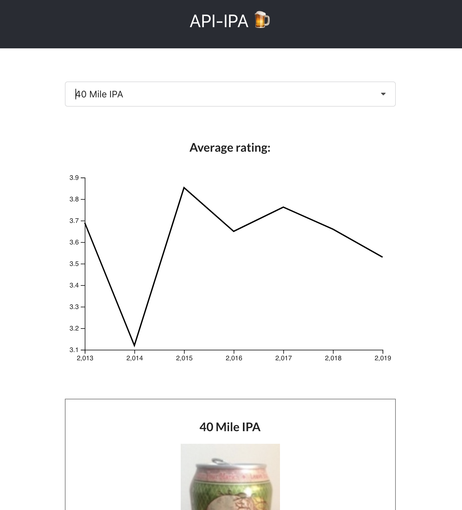
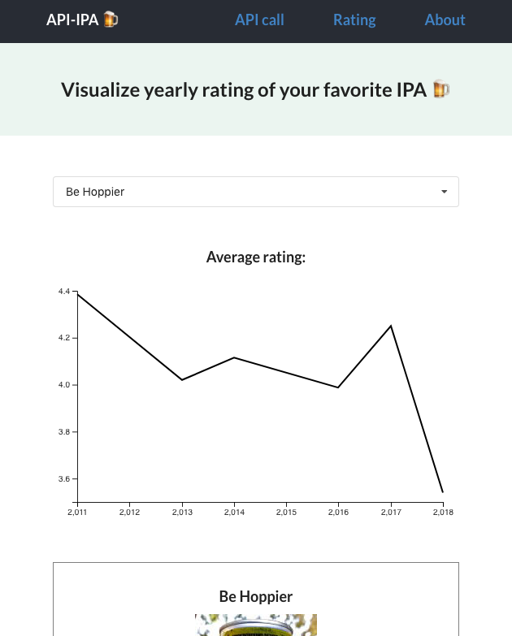

# API-IPA 🍺
- API using Node.js and MongDB
- Information about IPA which is beer 🍺🍻
- Progress @ Oct 27, 2019
  - Selection tool and result
  
  

  - Search beer by beer-name

  

- Line chart for yearly rating of selected beer
  - Used `d3.js`

  

- Things to do next
  - Add more data -- the number of rating so far
  - Add more databases -- brewery and beer-style
  - Axis text -- year, rating
  - ~~Make a new page for API call~~
    - Implement a form and text-GET-call JSON result --> editted to selection tool and it will show text API call after an user clicke submit button
  - Deploy backend and replace http API address

- Added routes for API call and rating
  - With `react-router-dom`

  