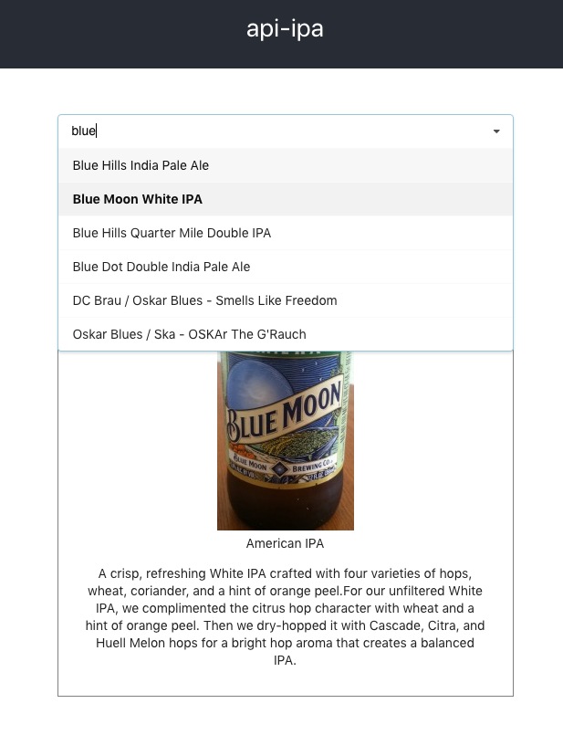

# API-IPA 🍺
- API using Node.js and MongDB
- Information about IPA which is beer 🍺🍻
- Progress @ Oct 27, 2019
  - Selection tool and result
  
  

  - Search beer by beer-name

  

- Line chart for yearly rating of selected beer
  - Used `d3.js`

  

- Things to do next
  - Add more data -- the number of rating so far
  - Add more databases -- brewery and beer-style
  - Axis text -- year, rating
  - ~~Make a new page for API call~~
    - Implement a form and text-GET-call JSON result --> editted to selection tool and it will show text API call after an user clicke submit button
  - ~~Deploy backend and replace http API address~~
    - Deployed on heroku: `https://areumjo-api-ipa.herokuapp.com`
    - `https://areumjo-api-ipa.herokuapp.com/beer/all` : list all IPA-beer-name (only)
    - `https://areumjo-api-ipa.herokuapp.com/beer/:beer-name` : get IPA by beer-name
      - for instance, calling `https://areumjo-api-ipa.herokuapp.com/beer/Duet`
      ```json
      {
        "_id": "5dab85303c5b5a04b53804e3",
        "name": "Duet",
        "ratings_year": {
          "1998": null, "2000": null, "2001": null, "2002": null, "2003": null, "2004": null, "2005": 1, "2006": 4, "2007": 6, "2008": 8, "2009": 69, "2010": 138, "2011": 133, "2012": 52, "2013": 42, "2014": 43, "2015": 222, "2016": 142, "2017": 27, "2018": 15, "2019": 5
        },
        "std_score_year": {
          "1998": null, "2000": null, "2001": null, "2002": null, "2003": null, "2004": null, "2005": null, "2006": 0.10750968948580092, "2007": 0.42898717929560554, "2008": 0.23378485225278647, "2009": 0.33005773346019296, "2010": 0.3019704059962421, "2011": 0.3604025811586399, "2012": 0.32295411279988206, "2013": 0.2143305218348789, "2014": 0.24710303803559974, "2015": 0.3133063710637199, "2016": 0.38778327264955414, "2017": 0.3554175747225402, "2018": 0.3610474180703111, "2019": 0.43729852503753064,
        "avg_score_year": {
          "1998": null, "2000": null, "2001": null, "2002": null, "2003": null, "2004": null, "2005": 4.35, "2006": 4.8925, "2007": 4.355, "2008": 4.383749999999999, "2009": 4.3417391304347825, "2010": 4.330072463768118, "2011": 4.278721804511279, "2012": 4.302115384615385, "2013": 4.468809523809524, "2014": 4.43860465116279, "2015": 4.220450450450449, "2016": 4.170140845070422, "2017": 4.112962962962961, "2018": 4.145333333333333, "2019": 3.8840000000000003
        },
        "abv": 7,
        "beer_img": "https://cdn.beeradvocate.com/im/beers/27604.jpg",
        "beer_style": "American IPA",
        "brewery": "Alpine Beer Company",
        "desc": "A soon-to-be favorite, if it's already not. This single IPA boasts pine, citrus, and cedar notes from Simcoe and Amarillo hops.",
        "family": "India Pale Ales"
      }
      ```
    - `https://areumjo-api-ipa.herokuapp.com/beer/:beer-name/rating` : get the number of ratings for the IPA by year excluding `null` data 
    - `https://areumjo-api-ipa.herokuapp.com/beer/:beer-name/score` : get the average score of the API by year excluding `null` data 


- Added routes for API call and rating
  - With `react-router-dom`

  

- Selection tool with deployed API-web address
  - Fixed ticks from x-axis 

  